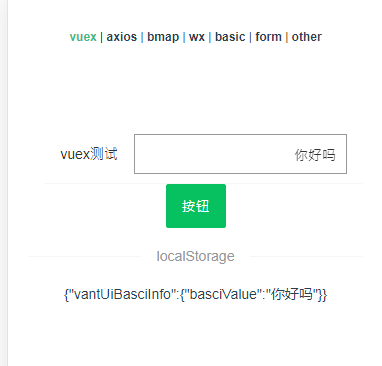
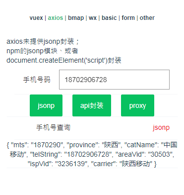
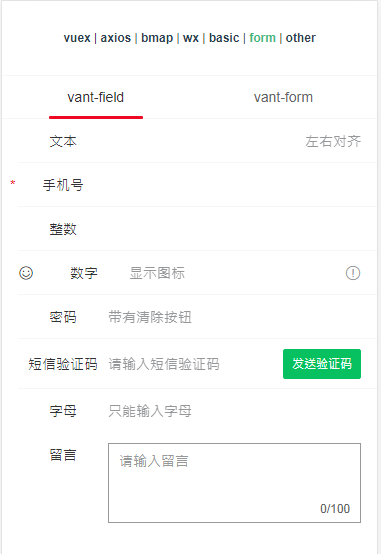

# "vant-prj" vue项目简介
vue-cli 3.0 + vue-router+ vux plugins插件 + 有赞vant UI整体解决方案;
#
模块化 vue-router、vuex；vuex 与 localStorage 数据同步
##
- 安装依赖 npm install
- 启动项目 npm run serve

## 功能列表

- vuex  观测 vuex 与 localStorage 
- axios api的封装、抽离 
- bmap  wx公众号定位、浏览器定位、ip定位、百度定位
- wx 微信基础能力
- vant field、picker等基础组件、弹框暴露js插件、日历类等。

## 截图展示

### 项目地址：[vant-prj](https://github.com/tcheng8866/vant-prj)
